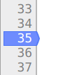
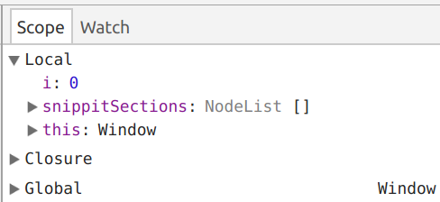

<!-- .slide: data-background-image="../images/bg-smartphone.jpg" -->
# HIT238 The mobile paradigm

<!-- .slide: data-background-image="../images/bg-smartphone.jpg" -->
## Unit Overview
* 4 hour lecture/tutorial every friday
	* Expected to attend
	* Will arrange regular contact with remote students
* You will need to already know basic HTML, CSS and Javascript

<!-- .slide: data-background-image="../images/bg-smartphone.jpg" -->
## Assignments
You will each develop your own application over the unit.

* 2 assignments
	* Assignment 1 - The Design Phase. 20%
	* Assignment 2 - The Development Phase. 30%

<!-- .slide: data-background-image="../images/bg-smartphone.jpg" -->
### Agile development
The assignments are structured around an agile model.

* 3 sprints in each assignment
* Sprints are 2 weeks each except for the final sprint of assignment 2
* You must submit your work at the end of each sprint
* Assignments are individual although some work will require a partner to complete

<!-- .slide: data-background-image="../images/bg-smartphone.jpg" -->
## Web Development Recap
* What can you remember?
* Grab a sheet of paper and see if you can answer these questions

<!-- .slide: data-background-image="../images/bg-smartphone.jpg" -->
* What is semantic HTML?

<!-- .slide: data-background-image="../images/bg-smartphone.jpg" -->
* How do you import a stylesheet in to a HTML document?

<!-- .slide: data-background-image="../images/bg-smartphone.jpg" -->
* How do you import javascript in to a HTML document

<!-- .slide: data-background-image="../images/bg-smartphone.jpg" -->
* What meta tag can you use to fix the mobile screen width?

<!-- .slide: data-background-image="../images/bg-smartphone.jpg" -->
* How do you apply CSS only to certain screen sizes?

<!-- .slide: data-background-image="../images/bg-smartphone.jpg" -->
* What does mobile first mean when writing CSS?

<!-- .slide: data-background-image="../images/bg-smartphone.jpg" -->
* How does a browser decide the order to apply CSS?

<!-- .slide: data-background-image="../images/bg-smartphone.jpg" -->
* Name three javascript best practices.

<!-- .slide: data-background-image="../images/bg-smartphone.jpg" -->
* How do you run a javascript function when a button is pressed?

<!-- .slide: data-background-image="../images/bg-smartphone.jpg" -->
* What is the difference between == and === in javascript?

<!-- .slide: data-background-image="../images/bg-smartphone.jpg" -->
## Mobile Applications
What do you think of when you think mobile apps?

What makes them "mobile"?

Note:
Spend 5 minutes thinking about what you think a mobile app is

<!-- .slide: data-background-image="../images/bg-smartphone.jpg" -->
### What is a mobile app?
* Can be accessed anywhere
* optimised for mobile devices
	* small screen
	* smaller attention span
	* may access sensors

Note:
A mobile app has some fundamental differences to a traditional application.
The biggest differences are lagely in the context of use and that mobile applications are often optimised for "mobile" devices

<!-- .slide: data-background-image="../images/bg-smartphone.jpg" -->
## Types of mobile applications
* Web applications
* Hybrid applications
* Cross-platform applications
* Native applications

Note:
There are different types of mobile applications depending on how they are developed. They fall into 3 or 4 broad categories depending on how they are developed

<!-- .slide: data-background-image="../images/bg-smartphone.jpg" -->
## Web Applications
* What is a web application?
* More than a web site
	* Interactive
	* It *does* something (doesn't just _tell you_ something)

Note:
A web application is not the same as a web site. For example you go to the CDU homepage to get some information, while you can interact with applications like twitter or facebook. 
The big difference between a web site like CDU and an application like facebook is interactivity. Facebook will respond to your actions while the CDU homepage will show the same information nomatter what you do. The line between a web side and a web application is not always clear, but as we are looking at applications we will be focusing in interactivity.

<!-- .slide: data-background-image="../images/bg-smartphone.jpg" -->
### Mobile web applications
* Can you name some web applications?
* Can you name some mobile web applications

Note:
Spend 5 minutes to see if you can think of some web applicationst that you use. Are they also mobile applications?

<!-- .slide: data-background-image="../images/bg-smartphone.jpg" -->
### Work from a past student
* Wanchaloem Sriwiset developed an alternative NT bus tracker
* The live bus tracking data has been blocked but you can see the app at [https://www.ntbustracker.com/](https://www.ntbustracker.com/)
* Mobile web apps don't need a lot of resources

<!-- .slide: data-background-image="../images/bg-smartphone.jpg" -->
### Mobile web applications
* Until recently it was difficult to make web applications work offline
* Many organisations prefer users to install their app
* Gmail and facebook messenger push users to install their app on mobile

Note:
While both Google and Apple originally imagined their mobile systems using web applications, many people did not consider them as compeditive alternatives to appliations installed on the mobile platform. Many organisations feel it is important that their app is installed in order to get exposure. Incedently [research found in 2015 that users spend most of their time in apps the majority of that use is only a couple of apps](https://techcrunch.com/2015/06/22/consumers-spend-85-of-time-on-smartphones-in-apps-but-only-5-apps-see-heavy-use/).
More recently service worksers and PWA manifests have allowed web applications to work more like native apps with installable menus and offline functionality bridging the gap between web and native.

<!-- .slide: data-background-image="../images/bg-smartphone.jpg" -->
### Why make mobile web applications
* Knowledge of web technologies is enough to build an app
* No installation required
* Easy to update
* Quick to prototype
* Typically cheaper to develop
* no app store registration or review

<!-- .slide: data-background-image="../images/bg-smartphone.jpg" -->
### Disadvantages of mobile web applications
* Not as fast as native code
* Less access to device sensors
* Less exposure?
* Different browsers may provide different experiences

<!-- .slide: data-background-image="../images/bg-smartphone.jpg" -->
### I &#x2764; web apps
* How many apps do you have that you needed for one task and never needed again?
* How many apps require a 40Mb download to do something trivial?

Note:
You've picked up a guitar and need to tune it. Install an app?
https://github.com/jbergknoff/guitar-tuner

<!-- .slide: data-background-image="../images/bg-smartphone.jpg" -->
## Progressive Web Apps (PWAs)
* Reliable - work offline
* Fast - No jank
* Engaging - Feel like a native application

https://developers.google.com/web/progressive-web-apps/

Note:
Progressive web applications (PWAs) are a recent category go web application.
Google defines them as reliable, fast and engaging.
They should work offline and feel fast and responsive like a native application

<!-- .slide: data-background-image="../images/bg-smartphone.jpg" -->
### Google &#x2764; web apps
* Read one of the following articles
	* https://developers.google.com/web/showcase/2017/twitter
	* https://developers.google.com/web/showcase/2017/olx
	* https://developers.google.com/web/showcase/2016/flipkart

Note:
Google have been promoting PWAs as an alternative to native applications.
Scan the provided articles to see some of the adavantages some users have found with PWAs.
It is interesting to note that two of the applications come from India where network connections are heavily utalised and have historically suffered from congestion problems. 

<!-- .slide: data-background-image="../images/bg-smartphone.jpg" -->
### Some clever mobile web apps
* Get our your phones and try out some mobile web apps
* https://pwa.rocks/

<!-- .slide: data-background-image="../images/bg-smartphone.jpg" -->
## Hybrid Apps

<!-- .slide: data-background-image="../images/bg-smartphone.jpg" -->
### What are hybrid apps?
* Typically a thin &quot;app&quot; wrapper around a web app
* Builds like a web app
* Installs like a native app
* Use a web view to display the web app

Note:
A hybrid application is a web application that has been bundled into an installable mobile package. They use a web view to display the web application as if it was a native app.

<!-- .slide: data-background-image="../images/bg-smartphone.jpg" -->
### Using a web view
* Wraps the web application in an native application wrapper that displays the apps

Note:
A web view is a browser window provided by the mobile platform that can render web pages.
They are similar to the default browser provided by the OS but may have some limitations.

<!-- .slide: data-background-image="../images/bg-smartphone.jpg" -->
### Advantages
* Put your app in the app stores
* Easy to develop with existing web technologies
* Single code base works on multiple platforms
* Better access to sensor and other devices features

<!-- .slide: data-background-image="../images/bg-smartphone.jpg" -->
### Disadvantages
* Can be slower
* Installs like a native app but may not feel native
* Cannot access all native functionality
* Users may be out of date if they have to update through the app store

<!-- .slide: data-background-image="../images/bg-smartphone.jpg" -->
### Something to look forward to
* We will learn more about hyrbid apps in week 8
* You will learn how to make a hybrid app using cordova

<!-- .slide: data-background-image="../images/bg-smartphone.jpg" -->
## Cross platform apps
 <!-- .element class="centre" -->

<!-- .slide: data-background-image="../images/bg-smartphone.jpg" -->
### What are cross platform apps
* Write app in one langage but compile to native code
* Some platforms like Appcellerator and React Native use web plafroms
* Other platforms like Unity and Xamarin use different languages

Note:
A cross-platform application is written in a non-native language which a framework compiles into native components.
They can use a variety of languages including web languages.
Frameworks using web languages like Appcellerator have been called hybrid apps in the past so the line between cross-platform and hybrid is not always clear.

<!-- .slide: data-background-image="../images/bg-smartphone.jpg" -->
"We've tried in the past to just build web apps that we could wrap in thin native wrappers, but it doesn’t work. [...] Anytime somebody tries to reimplement a native widget using HTML, CSS and JavaScript it always feels like shit."
- Tom Occhino, React Native, Facebook

<!-- .slide: data-background-image="../images/bg-smartphone.jpg" -->
### Advantages
* Target multiple platforms with a single code base
* Get performance benefits of native code
* Better access to sensors and device API
* Often a more native interface

<!-- .slide: data-background-image="../images/bg-smartphone.jpg" -->
### Disadvantages
* May not be as performant as native apps
* Some platforms may not create a native-like experience
* Need to be installed and updated through the app store

<!-- .slide: data-background-image="../images/bg-smartphone.jpg" -->
### More to come
* We will talk more about cross-platform apps at the end of the course

<!-- .slide: data-background-image="images/git-bg.jpg" -->
## Git, GitHub and GitHub Pages
* Hopefully everyone is familiar with GitHub
* You *must* use GitHub for this course so we will spend some time getting up to speed
* You will also need to use GitHub Pages to host your content

<!-- .slide: data-background-image="images/git-bg.jpg" -->
### What's the difference
* Git is a source control system
* Github is a public git repository (there are others)
* GitHub pages is a hosting platform like spinetail
* They are connected but are not the same

<!-- .slide: data-background-image="images/git-bg.jpg" -->
### Git
* Distributed
* Source Control
* Version Control

Note:
Git is a distributed, versioned, source control system. 
It is distributed because it can synchronise many repositories together. You keep a local copy of the repository and synchronise it with a server copy. Other users can do the same allowing everyone to keep their code synchorised.
It is versioned because it tracks all your changes in commits. Each commit records what changed so you can go back and view any version of the application. You can also use tags and branches to flag major versions.
It is source control because it holds your source code

<!-- .slide: data-background-image="images/git-bg.jpg" -->
### Why use git
* Share code
* Track changes
* Allow people to work together without breaking things

<!-- .slide: data-background-image="images/git-bg.jpg" -->
### Git functions
* Clone - Copy a repository to our local machine
* Add - Stage a file to commit
* Commit - Store a code change in git
* Push - send our code changes to the server
* Fetch - Get code from the server
* Merge - Mix new code in with ours or vice versa
* Rebase - Like merge but different

Note:
This are some common git functions. Don't worry, you don't need to learn them all now. You might also hear git pull. This is a shortcut command to fetch and merge

<!-- .slide: data-background-image="images/git-bg.jpg" -->
### WinGit client
* Lots of clients available
* Install git and sourcetree following instructions from [https://www.atlassian.com/git/tutorials/install-git](https://www.atlassian.com/git/tutorials/install-git)
* GUI with sourcetree and command prompt with Git Bash
* You will need to create an atlassian account to use sourcetree

Note:
There are a lot of git clients about. Most online instructions use git bash but sourcetree is a simple GUI tool that works on Windows, Mac and Linux

<!-- .slide: data-background-image="images/git-bg.jpg" -->
#### Clone a repository
[Sourcetree instructions to clone a repository](https://confluence.atlassian.com/sourcetreekb/clone-a-repository-into-sourcetree-780870050.html)

* Use method #1 to clone from github. 
* Use HTTP unless you are already familiar with SSH
* You can also [connect your github account](https://confluence.atlassian.com/get-started-with-sourcetree/connect-your-bitbucket-or-github-account-847359096.html)

Note:
Sourcetree provide instructions to clone a remote repository. When using github you will need to copy the HTTP URL into the repository URL dialog. You should remember how to fetch the URL from HIT226.

<!-- .slide: data-background-image="images/git-bg.jpg" -->
### Commit, Push and Pull
[Commit, fetch and pull a repository on sourcetree](https://confluence.atlassian.com/sourcetreekb/commit-push-and-pull-a-repository-on-sourcetree-785616067.html)

Note:
When you finish you'll need to commit to save your work and push to send them to the server. To do this you will need to save your changes in a "commit". Once your changes are comitted you will then need to send them to the server by pushing them. Remember, I can't see any work that you haven't pushed.
Finally you can pull other changes from the server. A pull is the same as doing a fetch and a merge.

<!-- .slide: data-background-image="images/git-bg.jpg" -->
### Activity: Setup a git repository
* Register for github
* Create a new repository for HIT238 with a readme and gitignore file
* Clone the repository to your local machine
* edit README.md to add a description of the repository
* Commit and push your changes
* Push your changes and check they appear on the github website

<!-- .slide: data-background-image="images/git-bg.jpg" -->
### Some tips
* Fetch from the server before you start writing
* Push whenever you finish writing
* A commit should be self-contained
	* If you are editing multiple files, include them all
	* Keep them small so it is easy to see what has changed
	* It is better to commit too much rather than not enough
	* Try not to break things

<!-- .slide: data-background-image="images/git-bg.jpg" -->
## GitHub Pages
* Free webhosting for your github project

<!-- .slide: data-background-image="images/git-bg.jpg" -->
### Activity: Setup GitHub pages on your repository
* Open your repository on the github website
* Go to settings and scroll down to GitHub Pages
* Ensure the branch is set to master
* Click select a theme
* Pick any theme
* Select commit
* Browse to [username].github.io/[repository name]
* [GitHub guide](https://guides.github.com/features/pages/)

<!-- .slide: data-background-image="images/git-bg.jpg" -->
### Jekyll
* When you commit GitHub compiles your markdown files to html
* The theme is used to decide how to render them
* If you don't have an index.html or index.md README.md will create your index page
* It can take a short time to update your content

<!-- .slide: data-background-image="images/git-bg.jpg" -->
### Adding new content
* Modify your README.md to include some details about yourself
* Commit and reload your GitHub pages URL (this may take a moment)
* Now create an index.html file and create a more detailed personal profile
	* Commit your changes and see how they appear
	* The theme is only used to markdown content

<!-- .slide: data-background-image="images/git-bg.jpg" -->
### Adding new content continued...
* Make your personal profile responsive and mobile first
* Share a link to your site on the discussion board

<!-- .slide: data-background-image="../images/bg-smartphone.jpg" -->
## Debugging Javascript
* Before we get in to javascript we need to learn to fix it

<!-- .slide: data-background-image="../images/bg-mouse.jpg" -->
### How do we debug
* Chrome developer tools provides us with an _inline debugger_
* We can step through our code, line by line as it actually executes

<!-- .slide: data-background-image="../images/bg-mouse.jpg" -->
### Debugging from the sources tab
1. Open up dev tools and go to sources to find all your js files
2. Open the file you want to debug
3. Find a line just before where you have a problem and click the line number
4. A blue arrow appears to indicate you have set a *break point*
5. When the code gets to your break point it will pause

<!-- .slide: data-background-image="../images/bg-mouse.jpg" -->
### Open the debugger
<video>
	<source data-src="videos/debug-open.webm" type="video/webm" />
</video>

<!-- .slide: data-background-image="../images/bg-mouse.jpg" -->
### Breakpoint
* Clicking on a line number creates a breakpoint
* When the code at the breakpoint is about to execute the browser will pause and open the deugger
* Lines with breakpoints are indicated with a blue arrow

<!-- .slide: data-background-image="../images/bg-mouse.jpg" -->
### Debug controls
* Play icon resumes normal code execution
* Step over continues to the next line in the current function
* Step into pauses on the first line of the function about to be executed
* Stop out pauses on the next line of the calling (parent) function
* Can you find out what the last two do?

<!-- .slide: data-background-image="../images/bg-mouse.jpg" -->
### Checking values
* You can hover your cursor over a variable to see the value it holds
* The scope pane shows all variables in the current scope
* You can add a variable to watch in the watch pane

<!-- .slide: data-background-image="../images/bg-mouse.jpg" -->
<video>
	<source data-src="videos/debug-breakpoint.webm" type="video/webm" />
</video>

<!-- .slide: data-background-image="../images/bg-smartphone.jpg" -->
### Your turn
* Clone the repository at https://github.com/CDU-HIT238/debug-exercises
* Open [one.html](https://cdu-hit238.github.io/debug-exercises/one.html) in your browser and use dev tools to fix the errors

<!-- .slide: data-background-image="../images/bg-smartphone.jpg" -->
### Get ready for next week
* Have a look at some mobile applications and think about what you would like to make
* Post three application ideas on the class discussion board
* If you have a genius idea don't keep it a secret
	* People don't buy an app because it is a great concept
	* People buy an app because it is great to use
