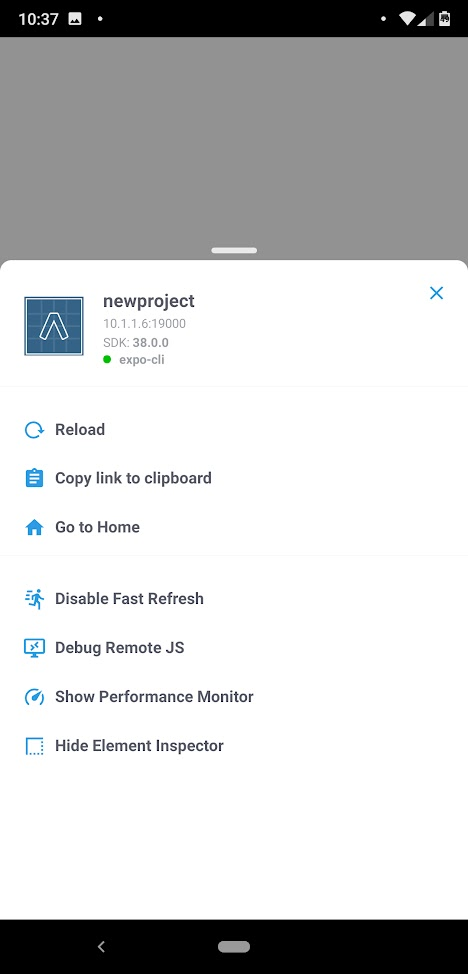
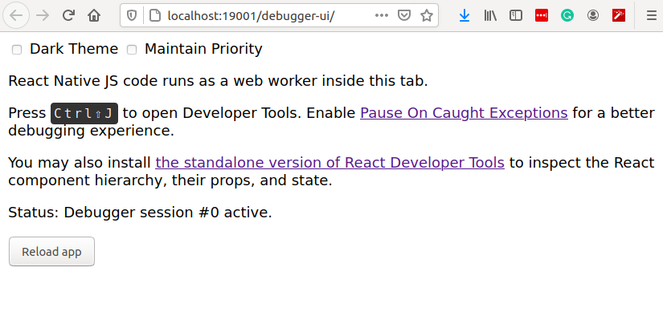

<!-- .slide: data-background-image="../images/bg-smartphone.jpg" -->
# HIT238 The mobile paradigm


<!-- .slide: data-background-image="../images/bg-smartphone.jpg" -->
## Troubleshooting
Lets work through how we troubleshoot programming problems


<!-- .slide: data-background-image="../images/bg-smartphone.jpg" -->
### Use comments
* console.log
* console.warn
* console.error
* Use them often


<!-- .slide: data-background-image="../images/bg-smartphone.jpg" -->
#### This code has problems
```js
/**
* Create an unordered list of the array items
* @TODO: This function doesn't work. It just returns an empty list
*        I think there are more errors too
* @param {string[]} The items to place in a list
* @return string Unordered list HTML string
*/
function createList(items) {
	var myList = '<ul>';
	for(i = 0; i > items.length; i++) {
		myList = '<li>'+items+'</li>'
	}
	myList += '<ul>';
	return myList;
}
var list = createList(['one', 'two', 'three']);
```


<!-- .slide: data-background-image="../images/bg-smartphone.jpg" -->
#### Comments help us find the problems
```js
/**
* Create an unordered list of the array items
* @TODO: This function doesn't work. It just returns an empty list
*        I think there are more errors too
* @param {string[]} The items to place in a list
* @return string Unordered list HTML string
*/
function createList(items) {
  console.log('Create list items', items);
	var myList = '<ul>';
	console.log('My list');
	for(i = 0; i > items.length; i++) {
	  console.log("List item " + i, item[i])l
		myList = '<li>'+items+'</li>'
		console.log('my list', myList);
	}
	myList += '<ul>';
	console.log('my list', myList);
	return myList;
}
var list = createList(['one', 'two', 'three']);
console.log('Final list', list);
```


### Use breakpoints in the debugger
* Click on a line number to set a break point
* Refresh the page
* Step over the code
* Hover over a variable to see the current value


<!-- .slide: data-background-image="../images/bg-smartphone.jpg" -->
<video>
	<source data-src="videos/debug-tools.webm" type="video/webm" />
</video>


<!-- .slide: data-background-image="../images/bg-smartphone.jpg" -->
* The video shows us that we are putting the whole array into the list item
	* We should be only inserted the item at the current index
* We can also see it runs multiple times but never changes
	* We should append the new HTML instead of assigning it


<!-- .slide: data-background-image="../images/bg-smartphone.jpg" -->
## Break your code up
* It is much easier to troubleshoot a 10 line function than a 50 line function
* Can you break your 50 line function into 5 10 line sections?
* You can pass dummy values into a function just to test if it works
* In industry we automatically pass dummy data with unit test
	* This helps us find errors we didn't know we created


<!-- .slide: data-background-image="../images/bg-smartphone.jpg" -->
### Activity
* Copy the createList function above into a new file
* Create a HTML page and load the createList function
* Add a button to call createList and pass it an array of strings
* Use the debugging to step through the code and fix any errors


<!-- .slide: data-background-image="../images/bg-smartphone.jpg" -->
## Debugging in React Native
* Expo gives us access to the browser console and debugger


<!-- .slide: data-background-image="../images/bg-smartphone.jpg" -->
* Shake your phone and select "Debug Remote JS"
 <!-- .element class="half-height centre no-border" -->


<!-- .slide: data-background-image="../images/bg-smartphone.jpg" -->
* This opens a browser window
* Your react native code runs in a web worker in this window
* This gives you access to the browser debug tools



<!-- .slide: data-background-image="../images/bg-smartphone.jpg" -->
* Now you can find your code and set breakpoints as normal


<!-- .slide: data-background-image="../images/bg-smartphone.jpg" -->
<video>
	<source data-src="videos/react-native-debugger.webm" type="video/webm" />
</video>


<!-- .slide: data-background-image="../images/bg-smartphone.jpg" -->
### Browser plugins
* There are also browser plugins for react native
* Thwy will give you a nicer debugging interface


<!-- .slide: data-background-image="../images/bg-smartphone.jpg" -->
### Activity
* Start your React Native app
* Start the debugger and step through a function
* Can you see your state values change?


<!-- .slide: data-background-image="../images/bg-smartphone.jpg" -->
## What problems are you having?
* Does anyone have code they want to troubleshoot?
* Share a link in collaborate and we can troubleshoot it together


<!-- .slide: data-background-image="../images/bg-smartphone.jpg" -->
## Finishing Up
* We've covered a lot this semester
* You don't have to remember how do to everything
	* But remember what tools there are and how to find them
* You don't learn from lectures
	* Go out and make things


<!-- .slide: data-background-image="../images/bg-smartphone.jpg" -->
### This world keeps changing
* The WebAPIs that we have learned are well established and should be around for a while
* The tools we've learned will not
	* We don't know what the next big tools will be
	* Experiment with lots of things and use your favourites


<!-- .slide: data-background-image="../images/bg-smartphone.jpg" -->
### Next Week: Revision
* General Recap of the past semester
* Any requests?
