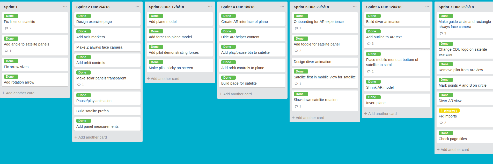

<!-- .slide: data-background-image="../images/bg-smartphone.jpg" -->
# HIT238 The mobile paradigm


<!-- .slide: data-background-image="../images/bg-smartphone.jpg" -->
## MVP
The smallest thing you can build that a customer can use


<!-- .slide: data-background-image="../images/bg-smartphone.jpg" -->
### How not to build an MVP
* Develop for everyone
* Look at the program functionality
* What is the first functionality you need to write
* What is the easiest functionality to write


<!-- .slide: data-background-image="../images/bg-smartphone.jpg" -->


Author/Copyright holder: Henrik Kniberg. Copyright terms and licence: All rights reserved <!-- .element class="attribution" -->


<!-- .slide: data-background-image="../images/bg-smartphone.jpg" -->
### How to build an MVP
* Develop just for your target audience
* Look at the user functionality
* What is the core functionality for the user
* What is the smallest product the customer can use


<!-- .slide: data-background-image="../images/bg-smartphone.jpg" -->


Author/Copyright holder: Jussi Pasanen. With acknowledgements to Aarron Walter, Ben Tollady, Ben Rowe, Lexi Thorn and Senthil Kugalur. Copyright terms and license: All rights reserved <!-- .element class="attribution" -->


<!-- .slide: data-background-image="../images/bg-smartphone.jpg" -->
### Why develop an MVP
* You can get user feedback throughout the process
* Test your ideas work with users
* Assess if users actually want your product
* Can address problems quickly
	* Less time wasted building something nobody wants
	* Less time wasted fixing something nobody likes


<!-- .slide: data-background-image="../images/bg-smartphone.jpg" -->
### An MVP does not have to be complete
* Many resources talk about MVP as the smallest product for each release
	* I disagree
	* MVP is a great way to release regularaly but an MVP is not a release
* Your MVP should be _usable_ not necessecary _complete_
* You don't release your first MVPs to public
* There should be a number of MVPs for each release


<!-- .slide: data-background-image="../images/bg-smartphone.jpg" -->
### What needs to be in an MVP
* Have some key feature(s) to test
* Have a clear target audience
* Be complete enough to test the feature(s)


<!-- .slide: data-background-image="../images/bg-smartphone.jpg" -->
### Some steps to develop an MVP
* Figure Out What Problem You're Solving, and For Whom
* Analyze Your Competitors
* Define the User Flow
* List All Necessary Features and Prioritize Them
* Build, Test, and Learn

From [How to Build a Minimum Viable Product](https://rubygarage.org/blog/how-to-build-a-minimum-viable-product)


<!-- .slide: data-background-image="../images/bg-smartphone.jpg" -->
### How I use MVPs
* I usually have x number of sprints - then release
* Spread features across the sprints until release
* Each sprint has an MVP, development, user testing and a client meeting
* After user testing and the client meeting, the features for the next sprint are updated


<!-- .slide: data-background-image="../images/bg-smartphone.jpg" -->


Note:
While the MVPs are not explicitly specified this project started developing a satellite exercise first as an interactive model, then as a web page. Then after it was developed and tested a plane was model developed and then an AR experience was developed. This was continued for a more complecated diver activity


<!-- .slide: data-background-image="../images/bg-smartphone.jpg" -->
### My steps to build an MVP
* Make a list of features to build
* Sort them in to core, important, desirable and unnecessary categories
* Sort the core category by priority
* Pick the most important - does it / do they depend on any others
* Sketch out wireframes and UX flows for those features
* Cut out anything unecessecary in the designs


<!-- .slide: data-background-image="../images/bg-smartphone.jpg" -->
### Reading
* The article [Minimum Viable Product and Design](https://www.interaction-design.org/literature/article/minimum-viable-product-mvp-and-design-balancing-risk-to-gain-reward) is an excellent resource
* There are lots of other great resources but be careful
	* Many are advising startups on their release products
	* They focus on what a user will buy - not how to get user feedback
	* The different uses of the term MVP can be confusing


<!-- .slide: data-background-image="../images/bg-smartphone.jpg" -->
### Activity: Design an MVP
* A restaurant has asked you to develop a mobile app to order take away
	* Their clientele is mostly 20 - 30 and often use their phones when waiting
	* Surveys indicate the clients would like to order from home and just pick up their food
	* Many would like to pay when they order but many also pay cash


<!-- .slide: data-background-image="../images/bg-smartphone.jpg" -->
### Activity: Continued
* Make a list of possible features
* What would be in an MVP
* Sketch out the UX flow for an MVP
* Share your MVP on the discussion board


<!-- .slide: data-background-image="../images/bg-smartphone.jpg" -->
### Bonus
<iframe width="560" height="315" src="https://www.youtube.com/embed/jHyU54GhfGs" frameborder="0" allow="autoplay; encrypted-media" allowfullscreen></iframe>


<!-- .slide: data-background-image="../images/bg-smartphone.jpg" -->
## Promises
* Alternative to callbacks
* Handle completion (or failure) of an asynchronous operation
* Sometimes called syntastic sugar
	* They don't give new functionality - just make the code nicer
* Added with ECMAScript 2015 (ES6)
* [Supported everywhere expect IE](https://caniuse.com/#search=promises)

Note:
Promises are a semi-recent addition to javascript.
They were added with ECMAScript 2015 and have been adopted by all major browsers.
They don't actually allow you do do anything new but they can be chained to avoid nested callbacks.


<!-- .slide: data-background-image="../images/bg-smartphone.jpg" -->
### Do this then that
With promises

```
asyncFunc()
	.then(function(response) {
		// Do stuff
	})
	.catch(function(error) {
		// Handle error
	});
```

Note:
Promises provide two key functions.
then: Run this code after the function completes successfully
catch: Run this code if the function fails


<!-- .slide: data-background-image="../images/bg-smartphone.jpg" -->
### Instead of callbacks
Without promises

```
asyncFunc(
	function(err, data) {
		if(err) {
			// Handle error
		} else {
			// Do stuff
		}
	}
);
```


<!-- .slide: data-background-image="../images/bg-smartphone.jpg" -->
### Chain your promises
```
loadJSON()
	.then(function(response) {
		return JSON.parse(response);
	})
	.then(function(jsonData) {
		// Do stuff
	})
	.catch(function(error) {
		// Handle error
	});
```

Note:
Promises really shine when we chain them together.  A chain of promises is a much nicer alternative to nested callbacks.
The catch function will be exected if there is an error anywhere along the chain.
Be careful though, long promise chains can swallow your errors and make it difficult to debug


<!-- .slide: data-background-image="../images/bg-smartphone.jpg" -->
### Beats callback hell
```
loadJSON(function(err, data) {
	if(err) {
		// handle error
		return;
	}
	doAsyncProcessing(data, function(err2, processedData) {
		if(err2) {
			// handle second error
			return;
		}
		// Do stuff
	});
});
```


<!-- .slide: data-background-image="../images/bg-smartphone.jpg" -->
### Make a promise
```
function timeoutPromise(time) {
	return new Promise(function(resolve, reject) {
		setTimeout(resolve, time);
	});
}
```

You rarely need to do this as you usually use existing promises

Note:
You usually consume existing promises.
But sometimes you may want to convert an existing callback function to use promises.
To do this you can return a new promise. To create a promise create a Promise object and pass it a function. The function takes two callbacks for arguments, resolve to call when it completes successfully and reject when it fails.
Resolve takes a completion object as an argument and reject takes an error object for the argument/


<!-- .slide: data-background-image="../images/bg-smartphone.jpg" -->
### Promise everything
You can wait for a group of functions to finish using Promise.all
```
Promise.all(arrayOfPromises)
	.then(function(responses) {
		// Everything is finished
	});
```


<!-- .slide: data-background-image="../images/bg-smartphone.jpg" -->
### Activity: Your turn
* Open the pen [Promises exercise](https://codepen.io/elvey/pen/PBRMBJ)
* Modify the function delayedUppserCase to
	* Return a new promise 
	* If the input is a string
		* Resolve the promise after 500ms with the input in upper case
	* If the input is not a string
		* Reject the promise after 500ms


<!-- .slide: data-background-image="../images/bg-smartphone.jpg" -->
## HTTP Requests
 <!-- .element class="light-bg" -->


<!-- .slide: data-background-image="../images/bg-smartphone.jpg" -->
### What is a HTTP request
* A HTTP request is what your browser does when you view a web page
* Request data of the HTTP protocol and receive data in response
* All web resources are usually loaded over HTTP
* You can see the requests you browser makes in the developer tools


<!-- .slide: data-background-image="../images/bg-smartphone.jpg" -->
### HTTP requests from JS
* Load data from a server
* Sometimes called [AJAX](https://developer.mozilla.org/en-US/docs/Web/Guide/AJAX/Getting_Started) (Asynchronous Javascript And XML)
* Get updated data without reloading the whole page
	* Less jank
	* Less network traffic


<!-- .slide: data-background-image="../images/bg-smartphone.jpg" -->
### XMLHttpRequest
* Previously used XMLHttpRequest
* Uses callbacks
* Was the standard for a long time
* Ugly and messy - many people used jQuery instead


<!-- .slide: data-background-image="../images/bg-smartphone.jpg" -->
### Fetch
* A modern solution
* Much nicer interface
* Uses promises


<!-- .slide: data-background-image="../images/bg-smartphone.jpg" -->
### Using fetch
```
fetch('data.json')
	.then(function(response) {
		console.log(response);
	});
```


<!-- .slide: data-background-image="../images/bg-smartphone.jpg" -->
### Handle the response
* Fetch results a [response object](https://developer.mozilla.org/en-US/docs/Web/API/Response)
* You can check status with response.status
* You can read the response body as text with response.text()
* You can read the response body as JSON with response.json()
* You can read file like data with response.blob()


<!-- .slide: data-background-image="../images/bg-smartphone.jpg" -->
### Exercise: Your turn
* See if you can load notes from the provided endpoint to the table
* [HIT238 Fetch Exercise](https://codepen.io/elvey/pen/qyXrMQ?editors=1111#)
* Save your solution, you will need it shortly


<!-- .slide: data-background-image="../images/bg-smartphone.jpg" -->
### Sending data with fetch
* Fetch takes a second argument for options
* Can set the following data
	* Method
	* Mode
	* Headers
	* Body


<!-- .slide: data-background-image="../images/bg-smartphone.jpg" -->
### Send JSON Data
* Set method to put or post
* Set content-type header to application/json
* Set body to JSON string
* Set mode to cors if required


<!-- .slide: data-background-image="../images/bg-smartphone.jpg" -->
```
fetch(url, {
	method: 'post',
	mode: 'cors',
	headers: {
		'Content-Type', 'application/json'
	},
	body: JSON.stringify(data)
});
```


<!-- .slide: data-background-image="../images/bg-smartphone.jpg" -->
### Your turn
* Add a form to your solution to  [HIT238 Fetch Exercise](https://codepen.io/elvey/pen/qyXrMQ?editors=1111#)
* Add a button to submit the form data to the server
	* This should be a post request
	* You will need to enable cors
* Show the success (or error) message to the user


<!-- .slide: data-background-image="../images/bg-smartphone.jpg" -->
## CORS
* Cross Origin Resource Sharing

 <!-- .element class="centre half-height" -->


<!-- .slide: data-background-image="../images/bg-smartphone.jpg" -->
### Same Origin Policy
* Browser restricts HTTP requests to resources within the same origin
* An origin is
	* Some host (subdomains are also excluded)
	* Same port
	* Same protocol
* Embedded resourecs are not restricted (images, CSS, scripts, etc...


<!-- .slide: data-background-image="../images/bg-smartphone.jpg" -->
### What is CORS
* CORS allows a resource to permit additional domains to access it
* The response header defines the pages that are permitted to access the resource
	* Defined in the Access-Control-Allow-Origin header
* For modify requests (not GET) the broswer makes a preflight request
	* Can see OPTIONS request in dev tools
* Server also declares if credentials may be sent with requests


<!-- .slide: data-background-image="../images/bg-smartphone.jpg" -->
### Using CORS
* Set mode to cors
* The browser will automatically handle CORS for your requests
* You get an invalid request error if CORS fails
* You may need to set credentials to include if authentication is required


<!-- .slide: data-background-image="../images/bg-smartphone.jpg" -->
### User CORS on the server
* If writing a server-side API you will need to set the Access-Control-Allow-Origin header
* The * directive is not well supported so it is best to specify the required domain name
* You can read the requestor domain from the Origin header in the request
* Look up CORS implementation for your language of choice


<!-- .slide: data-background-image="../images/bg-smartphone.jpg" -->
### Activity: Watch it happen
* Open up your solutions to the fetch activity
* Open the network tab and watch the requests get made
* Click on the requests and examine the headers
* Change the domain from notes.php to notes-nocors.php
	* What happens?


<!-- .slide: data-background-image="../images/bg-smartphone.jpg" -->
## Polyfills
* Implement newer functionality in older browsers

 <!-- .element class="centre half-height" -->


<!-- .slide: data-background-image="../images/bg-smartphone.jpg" -->
### Polyfill fetch
* [Fetch is not supported by IE browsers](https://caniuse.com/#search=fetch)
* We can provide this functionality manually using a [polyfill](https://github.com/github/fetch)
* You can find a CDN of this polyfill at https://cdn.jsdelivr.net/npm/whatwg-fetch@2.0.4/fetch.js


<!-- .slide: data-background-image="../images/bg-smartphone.jpg" -->
### Activity: Implement the fetch polyfill
* Include the CDN in your fetch exercise
* Examine the fetch object in your debugger or console
* Is it any different?
	* Why? Why not?


<!-- .slide: data-background-image="../images/bg-smartphone.jpg" -->
### Lots of polyfills
* [Promises](http://bluebirdjs.com/docs/api-reference.html) (arguably not a true polyfill)
* [Picture](http://scottjehl.github.io/picturefill/)
* [ClassList](https://developer.mozilla.org/en-US/docs/Web/API/Element/classList#Polyfill)
* [MathML](https://wet-boew.github.io/wet-boew/demos/mathml/mathml-en.html)
* [Video](https://www.mediaelementjs.com/) (more of a wrapper than a polyfill)
* Heaps more


<!-- .slide: data-background-image="../images/bg-smartphone.jpg" -->
### Modernizr
* [Modernizr](https://github.com/Modernizr/Modernizr) checks what functionality is available
* Can load polyfills when required
* [Simple Syntax](https://modernizr.com/docs/#using-modernizr-with-javascript)


<!-- .slide: data-background-image="../images/bg-smartphone.jpg" -->
### Don't overdo polyfills
Read the section "Is there a CSS Grid Polyfill" in [https://www.smashingmagazine.com/2017/11/css-grid-supporting-browsers-without-grid/](https://www.smashingmagazine.com/2017/11/css-grid-supporting-browsers-without-grid/#a-id-is-there-a-css-grid-polyfill-40-a-is-there-a-css-grid-polyfill)

Why is a grid polyfill a bad idea? Does this apply to other features?


<!-- .slide: data-background-image="../images/bg-smartphone.jpg" -->
### Progressive Enhancement
* Progressive enhancement and graceful degredation suggest
	* A site should work without newer features
	* Add functionality as it becomes available
* Only polyfill what is absolutely necessecary
