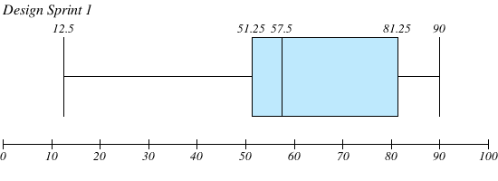
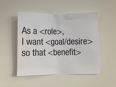

<!-- .slide: data-background-image="../images/bg-smartphone.jpg" -->
# HIT238 The mobile paradigm


<!-- .slide: data-background-image="../images/bg-smartphone.jpg" -->
## Design Sprint 1 Recap
* Some fantastic data gathered
* Before late penalties most grades between 51% and 80%



Note:
I hope everyone did well in the first design sprint. There is some fantastic data in there and some really valuable information that will help you design your application. Before late penalties the grades are spread quite broadly with most falling between 51% and 81%. There seems to have been a bit of confusion with the assignment and your individual feedback should address your work more specifically but as there was some confusion about what to do I'll provide an overall review here. 


<!-- .slide: data-background-image="../images/bg-smartphone.jpg" -->
### Extensions
* If you need an extension please see be _before_ the due date
	* Tell me why you need an extension and when you need it until
	* Requests less than 24 hours before the due date will not be considered without a medical certificate
	* Good practices for the workplace

Note:
If you are running out of time and need an extension please let me know before the due date. I understand that sometimes things can get hectic and am happy to accomodate your needs but you need to contact me beforehand with the reason you are running late and when you want an extension until. I won't consider anything within 24 hours of the due date without a medical certificate. 


<!-- .slide: data-background-image="../images/bg-smartphone.jpg" -->
### Submission
* Please follow the sumibssion guidelines
	* Link to google document
	* Follow the template
	* Caption images
* Make it readable
	* Images right way up
	* Lay things out clearly

Note:
Can you please submit your assignments as google documents (or through google drive)? I appreciate attaching a word document but it makes my job much easier if there is a link to your google doc and shows that you have read the assignment guidelines. Please also base your document off the provided template. If you haven't looked at the template please be sure to use it in your next submission.
If you are attaching images, please make sure they fit on the page and are the right way up.


<!-- .slide: data-background-image="../images/bg-smartphone.jpg" -->
### Problem Statement:
* Step back from your application idea and look at what it sets out to achieve
* Outline the user problems to solve
* Application functionality can come later
	* Just focus on the core problems

Note:
The problem statement should outline the user problems you want to solve. This is not the place to explain what your application will do, instead we want to look at the overall goal of our applications before we commit to a particular application idea.
Sometimes we get very attached to a particular application idea, which is not actually something our users are interested in. By stepping back from the app idea and first understanding how our users engage with the particular problem we can ensure our application idea is developed around their needs and environment.


<!-- .slide: data-background-image="../images/bg-smartphone.jpg" -->
### Research Objectives
* Generally done really well
* What you want to find out from the users
* First research to find out about your users
	* What is their experience of your problem?
	* What solutions have their tried
	* What are their frustrations?
* Information to use for personas
* Information to inform the initial concept and MVP designs

Note:
Your objectives should be the questions you want to find out from your users in order to design your application. Who are they, what is their experience of your target problem, what are thir frustrations and what has worked fro them. This information will be used to build your personas and to reframe your application concept to ensure it is relevant to your users. The "5Ws and an H" questions are a great place to start, you can take these further by tailoring them to your application and reducing them to a couple of broader core questions you want to know about your users.


<!-- .slide: data-background-image="../images/bg-smartphone.jpg" -->
### Research Hypotheis
* Your guess at answers to your objective questions
* Acknowledge your bias
	* Prevent bias influencing your research
* Identify when your hypothesis is far off
	* Do you need more research?

Note:
These are the answers you expect to the questions from your objectives. The purporse of this is to acknowledge your bias to prevent it from influencing your researc results, to better clarify how well you know your users and potentially identify area that may need more research. You are not looking to confirm your hypothesis but rather learn beyond it.


<!-- .slide: data-background-image="../images/bg-smartphone.jpg" -->
### Research Methods
* Overall well done
* Could be more specific
	* How do you want to conduct the research?
	* What are your survey questions?
	* What cards are people sorting and how will they sort them?
* Define your participants
	* Where will you recruit participants
	* How many particpants do you want

Note:
The methods were generally done well. These are the actual research methods you want to apply. You should be quite specific about what you are doing though. If you are doing a survey, the survey questions should be listed. If you are doing a card sort what cards are you asking people to sort and what criteria are they sorting them into? It is a bit premature for prototyping but if you prototype, what is the prototype you are showing participants and what are you asking them to do on it?
It is also important to outline how you are recruiting your participants. This can be as simple as going to the cafe and asking people or posting it on facebook. You should also outline how many particpants you aim to get. Recruiting methods can impact on the results and this is important in the workpace where you may have different people performing the research so the process needs to be as explicit as possible.


<!-- .slide: data-background-image="../images/bg-smartphone.jpg" -->
### Research Notes
* Some great data collected
* Outline the results of your research
* More than if the hypothesis is confirmed
* What did you learn?
* Are there any new research questions?
* Data is great but nothing personally identifying

Note:
This is where you outline the results from your research. Data is great to include but be careful not to include anything that can identify your participants. It is valuable to discuss how the results relate to your hypothesis but look at more than just if it support or contradicts your hypothesis. Are there any interesting observations? Are there any new questions your research has raised? Remember this information is the basis for your personas.


<!-- .slide: data-background-image="../images/bg-smartphone.jpg" -->
### Personas
* Don't just make up a person
	* _Use the data from your research_
	* _Fit them in your target audience_
* Use a template
* Flesh them out, make them feel relatable

Note:
Be sure to structure your personas well and provide some relevant personal information to make them more relatable. The big thing I wanted to see was the process of using personas to represent your user research. There is no value in just making up a user if it isn't grounded in some real user data. Personas are a great way to turn the lessons from your user research in to hypothetical users that you can reference throughout development. If your data is limited than you need to make some assumptions but try to capture as much of your research data as possible. You personas also need to reflect your target audience.


<!-- .slide: data-background-image="../images/bg-smartphone.jpg" -->
## User Stories
 <!-- .element class="centre" -->


<!-- .slide: data-background-image="../images/bg-smartphone.jpg" -->
### User stories are not the same as requirements
* Requirements are traditionally a list of features
* User stories are a list of functionality
	* They identify the user (or persona)
	* They state the function from the user perspective
	* They outline why it is important


<!-- .slide: data-background-image="../images/bg-smartphone.jpg" -->
As a &#95; I want to &#95; so that &#95;


<!-- .slide: data-background-image="../images/bg-smartphone.jpg" -->
### Get into the user perspective

Note:
Write from the perspective of your users. These are not developer requirements but user requirements. They should be worded like a user would write them, and concequently make sense to everyone, not just the developers.


<!-- .slide: data-background-image="../images/bg-smartphone.jpg" -->
### Use Personas

Note:
Now is the time to get our your personas. Who wants this feature? You can list a group of personas but keep them grounded to your personas. If it doesn't match your personas, you probably don't need the feature (or your personas are wrong).


<!-- .slide: data-background-image="../images/bg-smartphone.jpg" -->
### Keep them simple
Break stories up if you have to

Note:
It is common to use user stories with epics in agile. An epic is like a really big user story that takes multiple sprints to develop. They are often broken down into many user stories. There will usually be many user stories in a sprint.


<!-- .slide: data-background-image="../images/bg-smartphone.jpg" -->
### Examples: Gardener Application
* As a gardener I want to identify illness in my plants so I can treat them
* As a beginner I want to know when to plant tomatoes so they grow well
* As Max I want to know what plants grow well in the tropics

Note:
Personas can use broad user categories, specific categories or personas. You will find they are better grounded in your user research if you use your personas. 


<!-- .slide: data-background-image="../images/bg-smartphone.jpg" -->
### Your turn
* I want an application to remind people when to take their medication
* In your tables write as many user stories as you can for this application
* There are personas on the next slide


<!-- .slide: data-background-image="../images/bg-smartphone.jpg" -->
#### Personas
* Beatrice, a 70 year old woman who has trouble with phones. She has high blood pressure and takes blood thinners. She recently had pneumona and had to take a prolonged course of antibiotics.
* Kevin, a 45 year old carer for his elderly father. His father is perscribed heart medication his father often forgets to take.
* Susan, A 12 year old diabetic. She has only recently been diagnosed and doesn't like having to take insular or check or blood sugar as she finds it disrupts her other activities.


<!-- .slide: data-background-image="../images/bg-smartphone.jpg" -->
## Trello


<!-- .slide: data-background-image="../images/bg-smartphone.jpg" -->
### What is Trello?
* A tool for managing lists
* You can create many boards
* Each board can have many lists
* Each list can have many cards
* Each card can have labels, comments and be assigned to users
* It can track almost anything


<!-- .slide: data-background-image="../images/bg-smartphone.jpg" -->
### I use Trello at work
* Manage feature lists / user stories
* Map out sprints
* Track task progress
* Create to do lists
* Plan out the weekly topics for this class


<!-- .slide: data-background-image="../images/bg-smartphone.jpg" -->
### Create a board
* A board is like a workspace
* You can have many lists on one board
* Usually all lists are related


<!-- .slide: data-background-image="../images/bg-smartphone.jpg" -->
<video>
	<source data-src="videos/trello-create-board.webm" type="video/webm" />
</video>


<!-- .slide: data-background-image="../images/bg-smartphone.jpg" -->
### Create lists
* A list is like a category
* You often move cards between lists


<!-- .slide: data-background-image="../images/bg-smartphone.jpg" -->
<video>
	<source data-src="videos/trello-create-list.webm" type="video/webm" />
</video>


<!-- .slide: data-background-image="../images/bg-smartphone.jpg" -->
### Create cards
* A card is an individual item
* These are the things we are really tracking
* There are often lots of cards in a project


<!-- .slide: data-background-image="../images/bg-smartphone.jpg" -->
<video>
	<source data-src="videos/trello-create-cards.webm" type="video/webm" />
</video>


<!-- .slide: data-background-image="../images/bg-smartphone.jpg" -->
### Manage your cards
* Cards can be sorted into lists
* You can add labels to cards
* You can add attachments, checklists, comments and descriptions to cards
* You can assign cards to different people


<!-- .slide: data-background-image="../images/bg-smartphone.jpg" -->
<video>
	<source data-src="videos/trello-move-cards.webm" type="video/webm" />
</video>


<!-- .slide: data-background-image="../images/bg-smartphone.jpg" -->
<video>
	<source data-src="videos/trello-add-labels.webm" type="video/webm" />
</video>


<!-- .slide: data-background-image="../images/bg-smartphone.jpg" -->
### Check out the docs
* [Trello 101](https://trello.com/guide/trello-101) provides a basic introduction
* [Create a board](https://trello.com/guide/create-a-board) gives you a better walk through


<!-- .slide: data-background-image="../images/bg-smartphone.jpg" -->
### Your turn
* Register for Trello
* Create a new board called "Project MVP"
* Create some labels to sort your features by


<!-- .slide: data-background-image="../images/bg-smartphone.jpg" -->
## Geolocation API


<!-- .slide: data-background-image="../images/bg-smartphone.jpg" -->
* Get the user's current position
* Watch for changes in the position


<!-- .slide: data-background-image="../images/bg-smartphone.jpg" -->
### Some caveats
* The location API is only available on HTTPS connections
* The user must grant access to geolocation
* No guarantee that geolocation is available


<!-- .slide: data-background-image="../images/bg-smartphone.jpg" -->
### Check if geolocation is available
* Check for navigator.geolocation
	* If it is truthy than geolocation services are available

```js
if("geolocation" in navigator) {
	// location services are available
} else {
	// location services are not available
}
```


<!-- .slide: data-background-image="../images/bg-smartphone.jpg" -->
### Getting the current position
* navigator.geolocation.getCurrentPosition(successFunc, errFunc, options)
	* Get's the current position and calls a callback function
	* Calls successFunc when the location is successfully retrieved
	* successFunc takes a [Position](https://developer.mozilla.org/en-US/docs/Web/API/Position) parameter
	* Calls the optional errFunc when an error occurs
	* errFunc takes a [PositionError](https://developer.mozilla.org/en-US/docs/Web/API/PositionError) parameter
	* The optional [options](https://developer.mozilla.org/en-US/docs/Web/API/PositionOptions) parameter provides configuration 


<!-- .slide: data-background-image="../images/bg-smartphone.jpg" -->
### Using getCurrentPosition
```js
navigator.geolocation.getCurrentPosition(
	function(position) {
		console.log('Success', position);
	},
	function(err) {
		console.error('Error', err);
	}
);
```


<!-- .slide: data-background-image="../images/bg-smartphone.jpg" -->
### Reading the location
* The position object holds the [coordinates](https://developer.mozilla.org/en-US/docs/Web/API/Coordinates) and a timestamp

```
{
	coords: {
		accuracy: 30,
		altitude: null,
		altitudeAccuracy: null,
		heading: null,
		latitude: -12.388257999999999,
		longitude: 130.872771,
		speed: null
	},
	timestamp: 1532945280233
}

```


<!-- .slide: data-background-image="../images/bg-smartphone.jpg" -->
### Coordinates
* Accuracy - the accuracy of the location in metres
* Altitude - The altitude from sea level in metres
* Altitude Accuracy - The accuracy of the altitude in metres
* Heading - The direction of motion in degrees from true north
* Latitude - The current latitude in degrees
* Longitude - The current longitude in degrees
* Speed - The current velocity in metres per second


<!-- .slide: data-background-image="../images/bg-smartphone.jpg" -->
### Location accuracy
* By default getCurrentLocation tries to get a fast low-accuracy location
	* Usually from network location
* You can request a high accuracy location
	* Usually from GPS
	* Takes longer
	* May not be available


<!-- .slide: data-background-image="../images/bg-smartphone.jpg" -->
```
navigator.geolocation.getCurrentPosition(
	successFunc,
	errorFunc,
	{
		enableHighAccuracy: true
	}
);
```


<!-- .slide: data-background-image="../images/bg-smartphone.jpg" -->
### Activity: Add a marker to the map
* Open the pen [https://codepen.io/elvey/pen/BPJppR](https://codepen.io/elvey/pen/BPJppR)
* Add a marker at the current location using the addMarker() function
* Try with both high and low accuracy
	* Do you notice any difference
	* Why or why not?
* Test on a mobile device if you can
* Save your changes. You'll need them shortly


<!-- .slide: data-background-image="../images/bg-smartphone.jpg" -->
### Watching the location
* You can watch the current position for changes with watchPosition()
* Same input parameters as getCurrentLocation()
* The success callback gets called each time the position is updated
* You can stop watching using clearWatch()


<!-- .slide: data-background-image="../images/bg-smartphone.jpg" -->
```js
var watchID = navigator.geolocation.watchPosition(
	successFunc,
	errorFunc
);
navigator.geolocation.clearWatch(watchID);
```


<!-- .slide: data-background-image="../images/bg-smartphone.jpg" -->
### Activity: Update the map marker
* Go back to the code from your last activity
* Use watchLocation to move the marker when the position changes
* Use moveMarker() to update the marker position
* [Update your location](https://developers.google.com/web/tools/chrome-devtools/device-mode/device-input-and-sensors)


<!-- .slide: data-background-image="../images/bg-smartphone.jpg" -->
### Checking permission
* The geolocation API does not allow you to check if a user has granted permission or not
* The new [Permissions API](https://developer.mozilla.org/en-US/docs/Web/API/Permissions_API) does
	* But it [isn't fully supported](https://caniuse.com/#feat=permissions-api)


<!-- .slide: data-background-image="../images/bg-smartphone.jpg" -->
### Using the permissions API
```
navigator.permissions.query({
	name: 'geolocation'
})
	.then(function(permissions) {
		if(permissions.state === 'granted) {
			// permission granted
		} else if(permissions.state === 'denied') {
			// permission was denied
		} else if(permissions.state === 'prompt') {
			// we can prompt for permission
		}
	});
```


<!-- .slide: data-background-image="../images/bg-smartphone.jpg" -->
### Asking for permission
* It is a good practive to notify users before asking permission
* It can be confusing when a page unexpectedly asks for your location
* People are more likely to allow permission if they know why


<!-- .slide: data-background-image="../images/bg-smartphone.jpg" -->
## Web Storage


<!-- .slide: data-background-image="../images/bg-smartphone.jpg" -->
### What is web storage
* Data stores for the server origin
* Session Storage and Local Storage
* Save name/value pairs
* Limited data on each
* Does not work on data: URIs


<!-- .slide: data-background-image="../images/bg-smartphone.jpg" -->
### Storage limits
* 5mb for each on iOS
* 10MB each on Chrome
* 10MB shared on Firefox


<!-- .slide: data-background-image="../images/bg-smartphone.jpg" -->
### Session Storage 
* Save data for the duration of the session
* Used for temporary data
* Lasts as long as the browser is open
* Is only accessable from the current tab
* Persists across refreshes
* Removed when the tab is closed


<!-- .slide: data-background-image="../images/bg-smartphone.jpg" -->
### Set data
```
sessionStorage.setItem(key, value);
```


<!-- .slide: data-background-image="../images/bg-smartphone.jpg" -->
### Get data
```
var value = sessionStorage.getItem(key);
```


<!-- .slide: data-background-image="../images/bg-smartphone.jpg" -->
### Remove a key
```
sessionStorage.remove(key);
```


<!-- .slide: data-background-image="../images/bg-smartphone.jpg" -->
### Clear all data
```
sessionStorage.clear();
```


<!-- .slide: data-background-image="../images/bg-smartphone.jpg" -->
### Count keys
```
var count = sessionStorage.length;
```


<!-- .slide: data-background-image="../images/bg-smartphone.jpg" -->
### Read key
```
var key = sessionStorage.key(index);
```


<!-- .slide: data-background-image="../images/bg-smartphone.jpg" -->
### Putting it togther
Read all the key / values to an object

```
var data = {};
for(var i = 0; i < sessionStorage.length; i++) {
	var key = sessionStorage.key(i);
	var value = sessionStorage.getItem(i);
	data[key] = value;
}
```


<!-- .slide: data-background-image="../images/bg-smartphone.jpg" -->
### Activity: Your turn
* Open the pen [https://codepen.io/elvey/pen/MBBWPb](https://codepen.io/elvey/pen/MBBWPb)
* Add code to save data from the form to session storage
* Add code to load data from session storage and show it in the form
* Add code to remove a key from session storage
* Save your code and reload the page - what happens to your data
* Open a new tab and check your data


<!-- .slide: data-background-image="../images/bg-smartphone.jpg" -->
### Local Storage
* Persistant data storage
* Used for longer storage
* Lasts until deleted
* Is accessible from all windows
* Uses same API as sessionStorage


<!-- .slide: data-background-image="../images/bg-smartphone.jpg" -->
### Set data
```
localStorage.setItem(key, value);
```


<!-- .slide: data-background-image="../images/bg-smartphone.jpg" -->
### Get data
```
var value = localStorage.getItem(key);
```


<!-- .slide: data-background-image="../images/bg-smartphone.jpg" -->
### Remove a key
```
localStorage.remove(key);
```


<!-- .slide: data-background-image="../images/bg-smartphone.jpg" -->
### Clear all data
```
localStorage.clear();
```


<!-- .slide: data-background-image="../images/bg-smartphone.jpg" -->
### Count keys
```
var count = localStorage.length;
```


<!-- .slide: data-background-image="../images/bg-smartphone.jpg" -->
### Read key
```
var key = localStorage.key(index);
```


<!-- .slide: data-background-image="../images/bg-smartphone.jpg" -->
### Activity: Your turn
* Open the pen [https://codepen.io/elvey/pen/MBBWPb](https://codepen.io/elvey/pen/MBBWPb)
* Implement the same functionality with localStorage
* Save your code and reload the page - what happens to your data
* Open a new tab and check your data


<!-- .slide: data-background-image="../images/bg-smartphone.jpg" -->
### Storing objects
* How can you store objects in web storage?


<!-- .slide: data-background-image="../images/bg-smartphone.jpg" -->
```
localStorage.setItem(key, JSON.stringify(myObject));
```


<!-- .slide: data-background-image="../images/bg-smartphone.jpg" -->
### Private browsing
* Read [Private Browsing / Incognito Modes](https://developer.mozilla.org/en-US/docs/Web/API/Web_Storage_API#Private_Browsing_Incognito_modes)
* How do you think you should handle this?


<!-- .slide: data-background-image="../images/bg-smartphone.jpg" -->
## Mobile performance
 <!-- .element class="centre half-height no-border" -->


<!-- .slide: data-background-image="../images/bg-smartphone.jpg" -->
"The average time it takes to fully load a mobile landing page is 22 seconds, according to a new analysis.  Yet 53% of mobile site visitors leave a page that takes longer than three seconds to load."

From [Mobile page speed new industry benchmarks](https://think.storage.googleapis.com/docs/mobile-page-speed-new-industry-benchmarks.pdf) by Google


<!-- .slide: data-background-image="../images/bg-smartphone.jpg" -->
* Load time matters (although maybe not as much as we think)
* Mobile connections are highly variable
* Mobile devices are highly variable


<!-- .slide: data-background-image="../images/bg-smartphone.jpg" -->
### Page Sizes
* The average page size is over 3mb
* The average page size [probably doesn't matter much](https://speedcurve.com/blog/web-performance-page-bloat/)
* So what matters?


<!-- .slide: data-background-image="../images/bg-smartphone.jpg" -->
### Load time
* Remember the quote from earlier?
	* The average load time is 22 seconds according to google
	* 53% of people leave a page that takes longer to three seconds to load
* But what is the load time?
	* Fully loaded includes all resources
	* What matters is perceived load time or time to an interactive page
* Recommended target is < 3s


<!-- .slide: data-background-image="../images/bg-smartphone.jpg" -->
### So what matters
* Read [https://speedcurve.com/blog/web-performance-page-bloat/](https://speedcurve.com/blog/web-performance-page-bloat/)
* What do you think matters?


<!-- .slide: data-background-image="../images/bg-smartphone.jpg" -->
* What matters is time until a page feels loaded
* How long until you can start using the page?
* Minimise lag and loading time
* An [Ericsson study found video lag caused more stress than driving in heavy Jakarta traffic](https://www.ericsson.com/id/en/press-releases/7/2017/delay-in-video-streaming-creates-higher-stress-level-than-driving-in-heavy-jakarta-traffic)


<!-- .slide: data-background-image="../images/bg-smartphone.jpg" -->
### Cost of your page
* Page size still matters
* It's just about more than loading time
* The median page costs [4 cents in Australia](https://whatdoesmysitecost.com/)


<!-- .slide: data-background-image="../images/bg-smartphone.jpg" -->
### What to do
* Reduce percieved loading time
* Defer loading javascript
	* Set the defer flag
	* Put at the end of yor page body
* Minimise your resources
* Delay anything you don't need at the time
* Try not to wait on the server
* Preload resouces if you have time and are confidant you will need them

Note:
The defer flag should be enough to prevent your script from blocking the DOM from loading but it is a good idea to still put your scripts at the bottom to also cater to older browsers. 


<!-- .slide: data-background-image="../images/bg-smartphone.jpg" -->
### Minify your resources
* You can reduce to size of your CSS and JavaScript by minifying (or uglifying) it
* Try compresing resources at https://www.minifier.org/
* Compress your images at http://webresizer.com/resizer/
* Combine your JavaScript and CSS to reduce the number of files
	* This is less important with HTTP/2 but is still useful


<!-- .slide: data-background-image="../images/bg-smartphone.jpg" -->
### Reduce this page
* Clone the repository https://github.com/CDU-HIT238/HIT238-performance-exercise
* Can you reduce the perceived loading time of this page?
* Use [throttling](https://developers.google.com/web/tools/chrome-devtools/network-performance/reference#throttling) in Chrome dev tools to simulate a slower connection


<!-- .slide: data-background-image="../images/bg-smartphone.jpg" -->
### Prepare for next week
* Next week we will learn about some tools to make this easier
* Can you install [node and npm](https://nodejs.org/en/) before next week?
