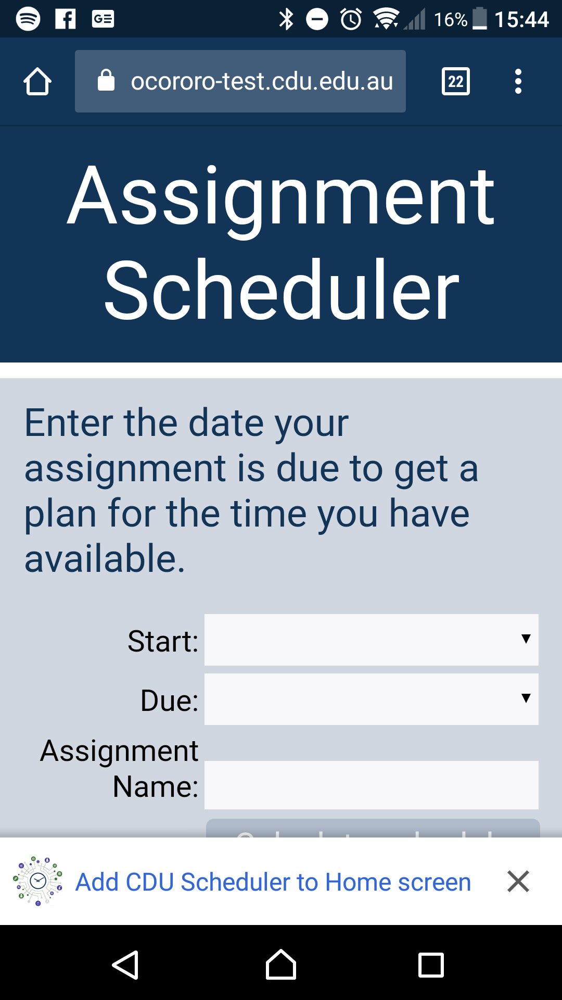

<!-- .slide: data-background-image="../images/bg-smartphone.jpg" -->
# HIT238 The mobile paradigm


<!-- .slide: data-background-image="../images/bg-smartphone.jpg" -->
## Using the git command line
* Every git GUI client is different
* Git has a consistant UI on every system
* Most instructions use the command prompt
* Open your terminals or Git Bash command prompts and follow along

Note:
So far we have used GUI git tools. Unfortunately the different platforms people use can be quite different. However everyone has access to the git command prompt. You're still welcome to use your git tools but it is good to have some exposure to the command prompt.


<!-- .slide: data-background-image="../images/bg-smartphone.jpg" -->
### The terminal
* don't worry, it's not as scary as it looks

Note:
When we think of command prompts we often think aobut super nerd hackers from the movies with walls of scrolling green text. Don't worry, it's much easier than that. With just a few basic commands you can unlock the power of git.


<!-- .slide: data-background-image="../images/bg-smartphone.jpg" -->
### Clone a repository
```
git clone git@github.com:CDU-HIT238/project-template.git
```

Note:
Use the git clone command to clone a repository from the server to your computer. GitHub actually provides you with the commands when setting up a new git repository.


<!-- .slide: data-background-image="../images/bg-smartphone.jpg" -->
<video>
	<source data-src="videos/git-clone.webm" type="video/webm" />
</video>


<!-- .slide: data-background-image="../images/bg-smartphone.jpg" -->
### Fetch and merge the current branch
```
git pull
```

Note:
In the windows Git GUI we leared, you had to fetch and then merge. The command line has an easy shortcut. Git pull will fetch changes from the server and merge them in to your current branch.


<!-- .slide: data-background-image="../images/bg-smartphone.jpg" -->
### Commit changes
```
git add ./path/to/changes
git commit -m "comment comment"
```

Note:
Just like from the GUI, you need to stage changed files before commiting them. You stage files with the git add command and provide the path to the files you want to stage. You then commit staged files with the git commit command. We use the m flag to provide a commit comment which is important to see what's changed.


<!-- .slide: data-background-image="../images/bg-smartphone.jpg" -->
### Push your changes to the server
```
git push
```

Note:
You upload your files to the server by running git push. It might prompt for your username and password if you are not already authenticated.


<!-- .slide: data-background-image="../images/bg-smartphone.jpg" -->
### Show changes
```
git status
```

Note:
You can see all the files that have changed using git status.


<!-- .slide: data-background-image="../images/bg-smartphone.jpg" -->
### Show the difference in files
```
git diff /path/to/files
```

Note:
You can look at what has changed in the files with git diff. Provide a path to the files you want to see. You can see all changes by passing the path . but it is often easier to read with less files at a time.


<!-- .slide: data-background-image="../images/bg-smartphone.jpg" -->
<video>
	<source data-src="videos/git-commit.webm" type="video/webm" />
</video>


<!-- .slide: data-background-image="../images/bg-smartphone.jpg" -->
### It's easy to walk back in time
Just checkout the commit hash (You can find the hash in your commit history)

```
git checkout 17df004
```

Note:
The command prompt also makes it easy to go back to an earlier commit. This is useful if you've lost a file or are looking for a solution that has since been removed.


<!-- .slide: data-background-image="../images/bg-smartphone.jpg" -->
### Rollback a specific file
You can even rollback a specific file from a previous commit

```
git checkout 17df004 -- /path/to/file/to/restore
```

Note:
You can also grab just one file from a previous commit. I often do this when fixing merge conflicts but it is also useful when a recent commit has broken something and you just want to switch back one file.


<!-- .slide: data-background-image="../images/bg-smartphone.jpg" -->
### Activity
* Clone your projects using the command line
* Make changes to your readme
* Commit and push the changes to the server


<!-- .slide: data-background-image="../images/bg-smartphone.jpg" -->
## Git Branches
* Save your work without affecting other code on the server

Note:
Git branches provide us way a way to keep working code isolated from the main code base. We usually do this to avoid breaking things while we are working.


<!-- .slide: data-background-image="../images/bg-smartphone.jpg" -->
### What is a branch
* A chain of commits
* Can have many branches
	* master branch is created automatically
* Can merge with other branches

Note:
If you think of your repository as a chain, with each commit linked to the commit before and after it, a branch is like a seperate chain. It's called a branch because it branches off from another commit. 


<!-- .slide: data-background-image="../images/bg-smartphone.jpg" -->
 <!-- .element class="bg-white centre" -->
<figcaption class="caption">"Git Branches" by Atlassian under CC BY 2.5 Australia; dimension attributes added, from Atlassian</figcaption>

Note:
You can see multiple branches drawn here. Develop branches off from master and two feature branches branch off develop


<!-- .slide: data-background-image="../images/bg-smartphone.jpg" -->
### Create a new branch
```
git checkout -b branch-name
git branch --set-upstream branch-name origin/branch-name
```

Note:
You can see a bit about how git works here. When you create a new branch, you are only creating it locally. You can use your local branch just the same until you want to push changes to the server. In order to push changes you need to link it to the server (or origin). We do this with set-upstream and link our local branch to one on the origin.


<!-- .slide: data-background-image="../images/bg-smartphone.jpg" -->
<video>
	<source data-src="videos/git-add-branch.webm" type="video/webm" />
</video>


<!-- .slide: data-background-image="../images/bg-smartphone.jpg" -->
### Set upstream branch
* Instead of calling set-upstream you can push with -u and tell it where to go
```
git push -u origin branch-name
```

Note:
Instead of calling set upstream when you create a branch you can tell git the destination the first time you push. -u tells git to remember the branch you use and you can omit the branch details for subsequent pushes.


<!-- .slide: data-background-image="../images/bg-smartphone.jpg" -->
<video>
	<source data-src="videos/git-branch-firstpush.webm" type="video/webm" />
</video>

Note:
You can see here what happens if you try to push without setting an upstream branch. If you forget git tells you the command to use.


<!-- .slide: data-background-image="../images/bg-smartphone.jpg" -->
### List your branches
```
git branch
```

Note:
You can get a list of all your local branches using git status. Note these are only local branches. To get branches on the server as well use git branch --all


<!-- .slide: data-background-image="../images/bg-smartphone.jpg" -->
### Switch local branches
```
git checkout branch-name
```

Note:
Use checkout to switch to a local branch. If a remote branch exists this will be linked to that


<!-- .slide: data-background-image="../images/bg-smartphone.jpg" -->
<video>
	<source data-src="videos/git-switching-branches.webm" type="video/webm" />
</video>


<!-- .slide: data-background-image="../images/bg-smartphone.jpg" -->
### Merge your changes
* Copy the changes from one branch to another
	* Checkout your target branch
	* Merge from the source branch
```
git checkout master
git pull
git merge branch-name
```

Note:
When you finish with a branch you need to bring your changes over to the master branch. You can use merge to copy the changes across. Merge is like a smart copy and will not overwrite anybodies work


<!-- .slide: data-background-image="../images/bg-smartphone.jpg" -->
<video>
	<source data-src="videos/git-merge-branch.webm" type="video/webm" />
</video>


<!-- .slide: data-background-image="../images/bg-smartphone.jpg" -->
### Your turn
* Create a new branch
* Commit and push some changes to the readme
* Merge your changes back in to master


<!-- .slide: data-background-image="../images/bg-smartphone.jpg" -->
### Best practices
Intead of merging into master your should raise a pull request
* Navigate to your GitHub repository
* Click the Pull Requests tab
* Click New pull request
* Select master in the base dropdown
* Select your branch in the compare dropdown
* Click create pull request


<!-- .slide: data-background-image="../images/bg-smartphone.jpg" -->
## Service Workers

Note:
Service workers are a special type of web worker that can act as a proxy for offline caching. It can also perform background sync and push notifications like other web workers.


<!-- .slide: data-background-image="../images/bg-smartphone.jpg" -->
### Web Workers
* A background process
* Runs in a different thread
* Different context to [window object](https://developer.mozilla.org/en-US/docs/Web/API/Window)
* Cannot access DOM
* Can access [a lot of other functions](https://developer.mozilla.org/en-US/docs/Web/API/Web_Workers_API/Functions_and_classes_available_to_workers)

Note:
Until now we've learned that javascript is asynchronous because it runs in the same thread. Web workers however let us run some scripts in an independant thread. This means they do not have access to the same window object (although they can access some window functions) and have no access to the DOM.


<!-- .slide: data-background-image="../images/bg-smartphone.jpg" -->
### Service Workers
* Has access to cache
* Can act as a network proxy
* Can talk to the page with postMessage()

Note:
A service worker is a special type of web worker. They have access to cache and can act like a network proxy. This means they can sit in between the HTTP requests your browser makes and decide how to handle them. The cache lets them store some requests for later so they can respond to a HTTP request without loading data from a server.
If you need to communicate between a service worker and your regular javascript you can use postmessage.


<!-- .slide: data-background-image="../images/bg-smartphone.jpg" -->
### Offline Web Apps
* Can save data in cache
* Can intercept requests and load data from cache when offline

Note:
Because a service worker can save HTTP data and respond with it later, this means, once your page has been loaded in cache it can work without an internet connection.


<!-- .slide: data-background-image="../images/bg-smartphone.jpg" -->
### Stages of a Service Workers
* Download
* Install
* Activate

Note:
Before we get too deep into implementation specifics it is worth having a quick look at the service worker lifecycle. When a new service worker is found it is first downloaded. After the download is completed it gets installed, this is when it can perform any setup it needs like preparing the cache. It then sits there waiting for any existing service workers to finish. As long as an old service worker has work to complete, a new one will not be activated. It will generally be activated after waiting a while, but sometimes it might take a refresh. You would usually clear out old caches after the service worker has activated as you know the old service worker has finished.


<!-- .slide: data-background-image="../images/bg-smartphone.jpg" -->
### Register a Service Worker
```
if ('serviceWorker' in navigator) {
  window.addEventListener('load', function() {
    navigator.serviceWorker.register('/sw.js').then(function(registration) {
      // Registration was successful
      console.log('ServiceWorker registration successful with scope: ', registration.scope);
    }, function(err) {
      // registration failed :(
      console.log('ServiceWorker registration failed: ', err);
    });
  });
}
```

Note:
To load a service worker you need to tell the browser to load it. The service worker must be in a seperate script which we direct the browser to load.
Here we can see we check if service workers are supported and wait for the page to finish loading. We then register the service worker using the function navigator.serviceWorker.register which returns a promise


<!-- .slide: data-background-image="../images/bg-smartphone.jpg" -->
### Service worker scope
* Service workers scope includes their path on
	* `/sw.js` can access anything from the root
	* `/pages/sw.js` can access anything after /pages
	* `./sw.js` can access anything under the current path

Note:
As service workers can act as a proxy we need to be clear on their active scope. They can only intercept requests from their current path onwards. They cannot get requests from their parent directory. So be careful, if you place your service worker in a scripts directory you will only be able to intercept your scripts.


<!-- .slide: data-background-image="../images/bg-smartphone.jpg" -->
### Creating your service worker
```
var CACHE_TITLE = 'my-site-cache';
var CACHE_VERSION = 'v1';
var CACHE_NAME = CACHE_TITLE + '-' + 'CACHE_VERSION';
var urlsToCache = [
  '/',
  '/styles/main.css',
  '/script/main.js'
];

self.addEventListener('install', function(event) {
  // Perform install steps
  event.waitUntil(
    caches.open(CACHE_NAME)
      .then(function(cache) {
        console.log('Opened cache');
        return cache.addAll(urlsToCache);
      })
  );
});
```

Note:
The follow code will create a service worker. It will need to be saved in the file you referenced from navigator.serviceWorker.register(). In the example above this would be sw.js.
We'll break down the key functions in the following slides


<!-- .slide: data-background-image="../images/bg-smartphone.jpg" -->
### caches.open(cacheName)
Opens the given cache and returns a promise that resolves to the cache


<!-- .slide: data-background-image="../images/bg-smartphone.jpg" -->
### cache.addAll(arrayOfUrls)
Saves the provided files in the cache


<!-- .slide: data-background-image="../images/bg-smartphone.jpg" -->
### Check your service worker
* You can check your service workers using chrome dev tools
* Check the application tab -> Service Workers


<!-- .slide: data-background-image="../images/bg-smartphone.jpg" -->
<video>
	<source data-src="videos/devtools-serviceworker.webm" type="video/webm" />
</video>


<!-- .slide: data-background-image="../images/bg-smartphone.jpg" -->
### Check your cache
* You can check the contents of your cache using chrome dev tools.
* Check the applications tab -> cache storage -> cache name


<!-- .slide: data-background-image="../images/bg-smartphone.jpg" -->
<video>
	<source data-src="videos/devtools-cache.webm" type="video/webm" />
</video>


<!-- .slide: data-background-image="../images/bg-smartphone.jpg" -->
### Your turn
* Clone one of your repositories
	* You can use git@github.com:melvey/darwin-street-food.git if none are suitable
* Add a service worker
* Identify files to cache form the network tab
* Load the page and check your cache in dev tools


<!-- .slide: data-background-image="../images/bg-smartphone.jpg" -->
### Load from the cache
```
self.addEventListener('fetch', function(event) {
  event.respondWith(
    caches.match(event.request)
      .then(function(response) {
        // Cache hit - return response
        if (response) {
          return response;
        }
        return fetch(event.request);
      }
    )
  );
});
```

Note:
To load data from the cache you need to catch HTTP requests. Each HTTP request fires a fetch event that we can listen for.


<!-- .slide: data-background-image="../images/bg-smartphone.jpg" -->
### Fetch event
* The fetch event is triggered on each outgoing http request
* The event contains the request in FetchEvent.request
* You can resolve the event with FetchEvent.respondWith()
	* Takes a promise that resolves to a response object


<!-- .slide: data-background-image="../images/bg-smartphone.jpg" -->
### Searching the cache
* [Cache.match()](https://developer.mozilla.org/en-US/docs/Web/API/Cache/match)
	* Resolve a [Response](https://developer.mozilla.org/en-US/docs/Web/API/Response) for the first matching Request in the cache
	* Takes a request as an argument
	* If there is no match the promise resolves undefined


<!-- .slide: data-background-image="../images/bg-smartphone.jpg" -->
### Now your page works offline


<!-- .slide: data-background-image="../images/bg-smartphone.jpg" -->
<video>
	<source data-src="videos/serviceworker-network-tab.webm" type="video/webm" />
</video>


<!-- .slide: data-background-image="../images/bg-smartphone.jpg" -->
<video>
	<source data-src="videos/serviceworker-offline.webm" type="video/webm" />
</video>


<!-- .slide: data-background-image="../images/bg-smartphone.jpg" -->
### Your turn
* Add a fetch event listener to load responses from the cache
* Watch your network tab
* Disable the network and reload the page


<!-- .slide: data-background-image="../images/bg-smartphone.jpg" -->
### Update a Service Worker
```
self.addEventListener('activate', function(event) {

  event.waitUntil(
    caches.keys().then(function(cacheNames) {
      return Promise.all(
        cacheNames.map(function(cacheName) {
					if(cacheName !== CACHE_NAME && cacheName.indexOf(CACHE_TITLE) === 0) {
            return caches.delete(cacheName);
          }
        })
      );
    })
  );
});
```


<!-- .slide: data-background-image="../images/bg-smartphone.jpg" -->
* [ExtendableEvent.waitUntil()](https://developer.mozilla.org/en-US/docs/Web/API/ExtendableEvent/waitUntil) tells the event manager that work is still going
* Iterate through all the cache names
* If a cache name matches ours but with a different version, delete it
* If you use multiple caches you can use a whitelist


<!-- .slide: data-background-image="../images/bg-smartphone.jpg" -->
### Your turn
* Add the activate listener
* Increase the promise version number
* Reload and examine the cache in chrome dev tools


<!-- .slide: data-background-image="../images/bg-smartphone.jpg" -->
### Extra resources
* Google have a great [introduction to service workers](https://developers.google.com/web/fundamentals/primers/service-workers/)


<!-- .slide: data-background-image="../images/bg-smartphone.jpg" -->
## Manifest
* JSON file describing how your app should work when installed


<!-- .slide: data-background-image="../images/bg-smartphone.jpg" -->
```
{
	"name": "CDU Assignment Scheduler",
	"short_name": "CDU Scheduler",
	"icons": [
		{
			"src": "images/icons/icon-128.png",
			"sizes": "128x128",
			"type": "image/png"
		},
		{
			"src": "images/icons/icon-512.png",
			"sizes": "512x512",
			"type": "image/png"
		}
	],
	"start_url": ".",
	"display": "standalone",
	"background_color": "#FFF",
	"theme_color": "#123557"
}
```


<!-- .slide: data-background-image="../images/bg-smartphone.jpg" -->
### name & short_name
* short_name is used where space is limited
	* app launcher
* name is used where it is not
	* install prompt
	* loading screen
* Google recommends keeping short_name to less than 12 character


<!-- .slide: data-background-image="../images/bg-smartphone.jpg" -->
### start_url
* The URL to load when launching the app
* Make sure this is cached by your service worker
	* If you cache / and your start_url is index.html it will not resolve


<!-- .slide: data-background-image="../images/bg-smartphone.jpg" -->
### display
* How you want your app to open
	* fullscreen - no browser UI elements and take up the full screen
	* standalone - no browser UI elements in a seperate window from the browser
	* browser - Open in the browser


<!-- .slide: data-background-image="../images/bg-smartphone.jpg" -->
### orientation
* Force the app to open in a particular orientation
	* landscape: force to landscape view
	* portrait: force to portrait view


<!-- .slide: data-background-image="../images/bg-smartphone.jpg" -->
### background_color
* The app background colour
* Used on splash screen when launching your app


<!-- .slide: data-background-image="../images/bg-smartphone.jpg" -->
### theme_colour
* The colour to set the toolbar and the task switcher
* Should match the theme-color meta tag
```
    <meta name="theme-color" content="#123557">
```


<!-- .slide: data-background-image="../images/bg-smartphone.jpg" -->
### icons
* Array of icons to use for the the app launcher, loading screen, etc..
* Set src, type and sizes
* The browser will scale icons to fit if required so you can just target key sizes


<!-- .slide: data-background-image="../images/bg-smartphone.jpg" -->
### Adding the manifest
* Add a reference to the manifest in the head html

```
<link rel="manifest" href="manifest.json">
```


<!-- .slide: data-background-image="../images/bg-smartphone.jpg" -->
### Now it installs
 <!-- .element class="centre no-border half-height" -->


<!-- .slide: data-background-image="../images/bg-smartphone.jpg" -->
### Your turn
* Add a manifest to your app
* Deploy to github pages
* Examine the manifest in the dev tools application tab
* Run a lighthouse report on your page


<!-- .slide: data-background-image="../images/bg-smartphone.jpg" -->
## Progressive Web Apps
* You have now build a progressive web app
	* works offline
	* Can install to android


<!-- .slide: data-background-image="../images/bg-smartphone.jpg" -->
### But what about IOS
* [PWAs Are Now Available for Apple Devices with iOS 11.3](https://www.monterail.com/blog/pwa-for-apple-ios)
* [Progressive Web Apps on iOS are here](https://medium.com/@firt/progressive-web-apps-on-ios-are-here-d00430dee3a7)


<!-- .slide: data-background-image="../images/bg-smartphone.jpg" -->
### Some limitations on iOS
* Only 50Mb storage
* App gets cleared out if not used
* No background sync or push notifications
* No notification to install the app


<!-- .slide: data-background-image="../images/bg-smartphone.jpg" -->
### So how do you install it?
* Click share -> add to home screen


<!-- .slide: data-background-image="../images/bg-smartphone.jpg" -->
### iOS doesn't use the manfest icons
* Need to set the icon meta tags
* Good idea to set all the fancy apple tags

```
    <meta name="apple-mobile-web-app-capable" content="yes">
    <meta name="apple-mobile-web-app-status-bar-style" content="black">
    <meta name="apple-mobile-web-app-title" content="Assignment Scheduler">
    <link rel="apple-touch-icon" href="images/icons/icon-152.png">
```


<!-- .slide: data-background-image="../images/bg-smartphone.jpg" -->
### Your turn
* Add the apple tags to your app
* Deploy to github pages
* See if someone with iOS 11.3 can install your app


<!-- .slide: data-background-image="../images/bg-smartphone.jpg" -->
## Activity: Make a shopping list
* Create a new git repository
* Create a form to save shopping items and quantity
* Save them to IndexedDB
* Show items in a list
* Checkoff items
* Add a serviceworker and manifest to work offline
